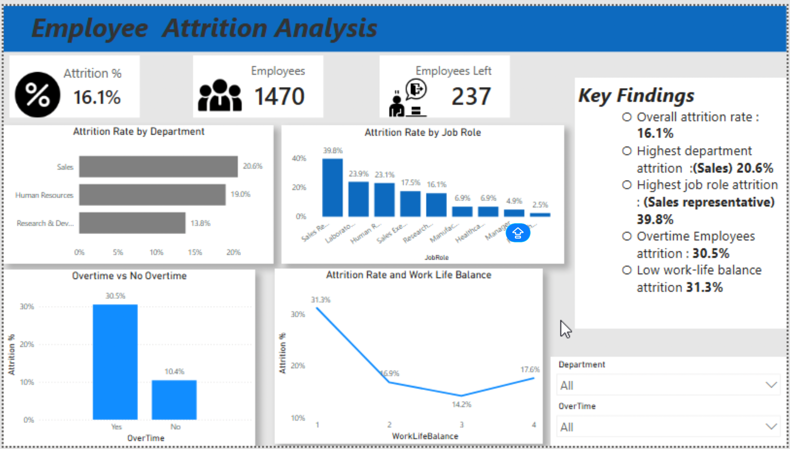

# Employee Attrition Analysis Dashboard (Power BI)

# Employee Attrition Analysis Dashboard

## Dashboard Preview

## Project Overview

This project analyses employee attrition using HR data and Power BI to identify key drivers of employee turnover and provide business recommendations.

## Project Overview

This project analyses employee attrition using HR data and Power BI to identify the key drivers of employee turnover and provide actionable business recommendations.

## Business Problem

Employee attrition can result in increased recruitment costs, loss of organisational knowledge, and reduced productivity. The objective of this project was to identify factors associated with employee turnover and provide data-driven recommendations to improve employee retention.

## Dashboard Features

- Overall Attrition Rate KPI
- Total Employees KPI
- Employees Left KPI
- Attrition Rate by Department
- Attrition Rate by Job Role
- Attrition vs Overtime Analysis
- Attrition vs Work-Life Balance Analysis
- Interactive Department and Overtime slicers
- Key Findings Summary Panel

## Key Findings

- Overall attrition rate: 16.1%
- Sales department recorded the highest attrition rate (20.6%)
- Sales Representatives recorded the highest attrition rate (39.8%)
- Employees working overtime showed significantly higher attrition (30.5%)
- Employees with poor work-life balance showed higher attrition rates

## Recommendations

1. Improve workplace environment factors.
2. Review overtime practices and workload distribution.
3. Implement retention initiatives for Sales Representatives.
4. Improve onboarding and career development for employees with less than two years of service.

## Files Included

- Employee_attrition_analysis.pbix
- Raw data.xlsx
- Employee Attrition Analysis Report.pdf

## Tools Used

- Power BI
- DAX
- Excel
- Data Visualisation
- Business Analysis

## Skills Demonstrated
- Power BI
- DAX
- Data Cleaning
- Data Visulisation
- Business Analysis
- Dashboard Design
- KPI Development
- HR Analytics

## Author

Harry Evans

LinkedIn: https://www.linkedin.com/in/harry-evans-analytics

GitHub: https://github.com/HarryE-DA
